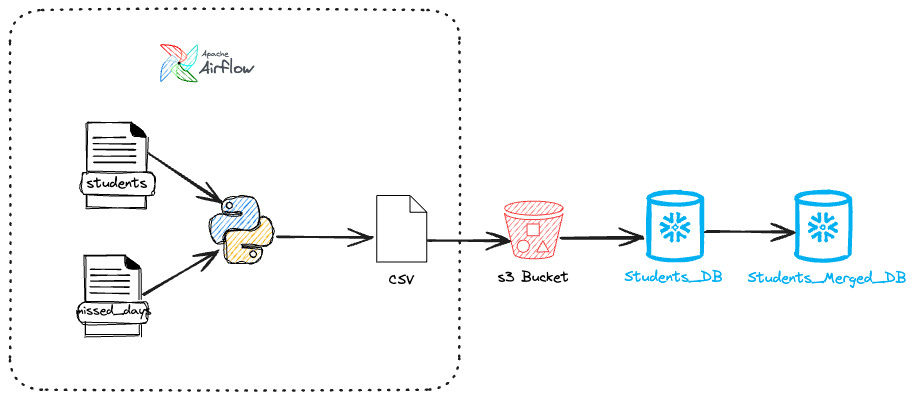
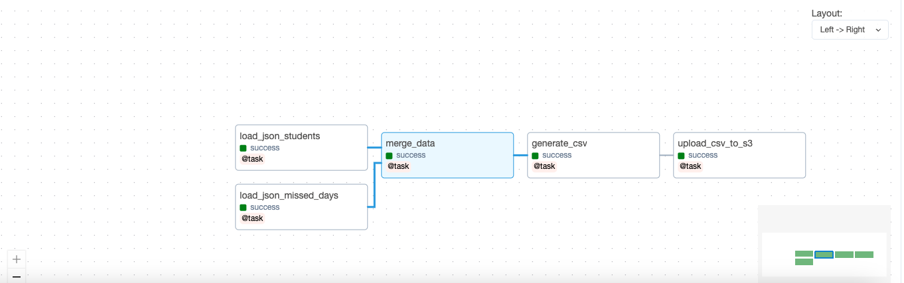
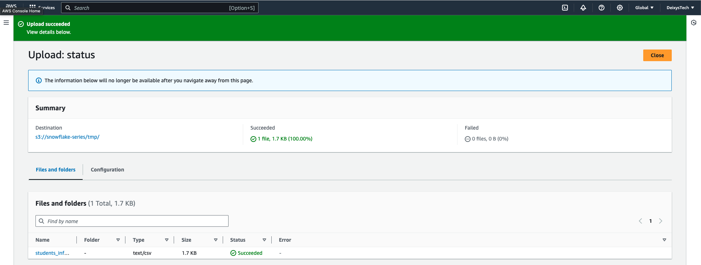
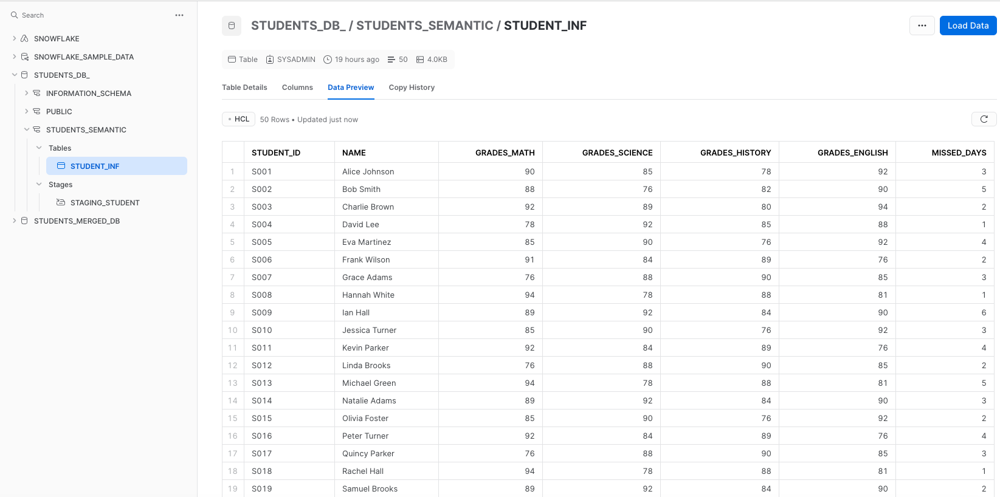
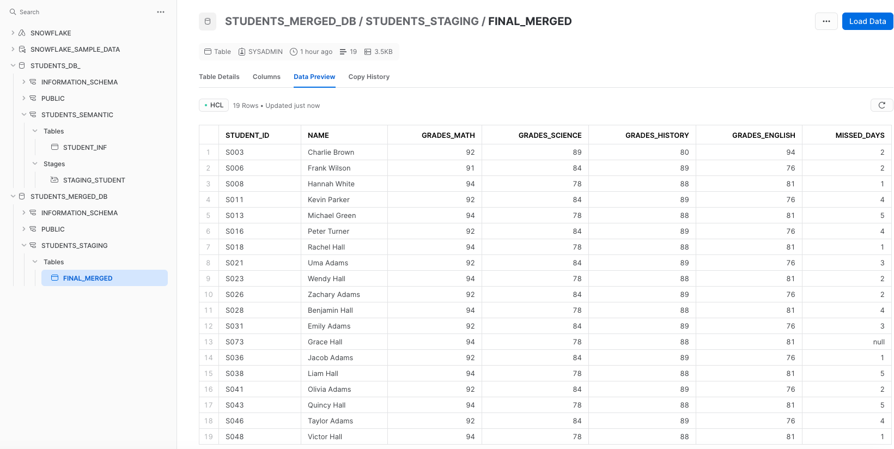

# Final Coding Evaluation

## Goal:
> Create an Airflow pipeline to migrate student data into Snowflake.

* For that were used two JSON files:

    1. students.json

    2. missed_days.json

> For process orchestration were developed the following funcions in dag structure:

- **load_json_students**: load the json containing the student data:

  | student_id| name | grades_math | grades_science | grades_history | grades_english |

-  **load_json_missed_days**: load the json containing the missed data. 

    | student_id | missed_days |

- **merge_data**: merge data from both generated dataframes using 'student_id' as key

- **generate_csv**: generate a CSV from previous merged dataframe.

- **upload_csv_to_s3**: upload CSV to an s3 Bucket.

### Snowflake

> In **Snowflake**, the CSV file was loaded in the Student_DB Database in table STUDENT_INF.

> The table FINAL_MERGED was created in STUDENT_MERGED_DB filtering Math grade greater than 90:

